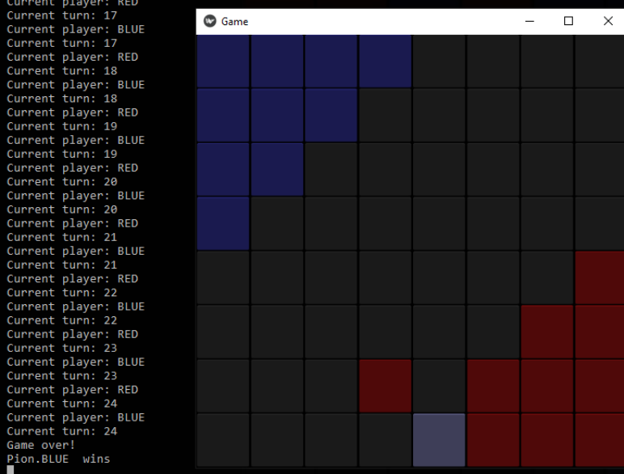

# Halma-AI
Made using Kivy





## Prerequisite
1. Python 3

## Setup
for python up to 3.7
```
pip install --upgrade -r requirements.txt
```

for Python 3.8+
```
pip install --upgrade -r requirements.txt
pip install --pre --extra-index-url=https://kivy.org/downloads/simple kivy[base]
```

## Running
Run
```
python main.py
```

or

Download executable on [releases](https://github.com/JonathanGun/halma-ai/releases) tab
Run exe


## Packaging
### Windows executable
Double click `build.bat`, or run:
```
python -m pip install --upgrade buildozer
python -m pip install --upgrade pyinstaller
pyi-makespec --name halma --icon=resource/icon.ico --add-data resource/*;. --add-data *.py;. --onefile main.py
python editspec.py -f=halma.spec
pyinstaller --clean --noconfirm halma.spec
```

### Android
```
buildozer init
```
edit `buildozer.spec`, then run
```
buildozer android debug deploy run
```
device must be connected to pc, more info check https://kivy.org/doc/stable/guide/packaging-android.html

## Acknowledgement
This project is made to fulfill IF3170 Artificial Intelligent course.

## Authors
[Ricky Fernando](https://github.com/rickymen) - 13518062
[Jonathan Yudi Gunawan](https://github.com/JonathanGun) - 13518084
[Morgen Sudyanto](https://github.com/moondemon68) - 13518093
[Chokyi Ozer](https://github.com/ozer0532) - 13518107

